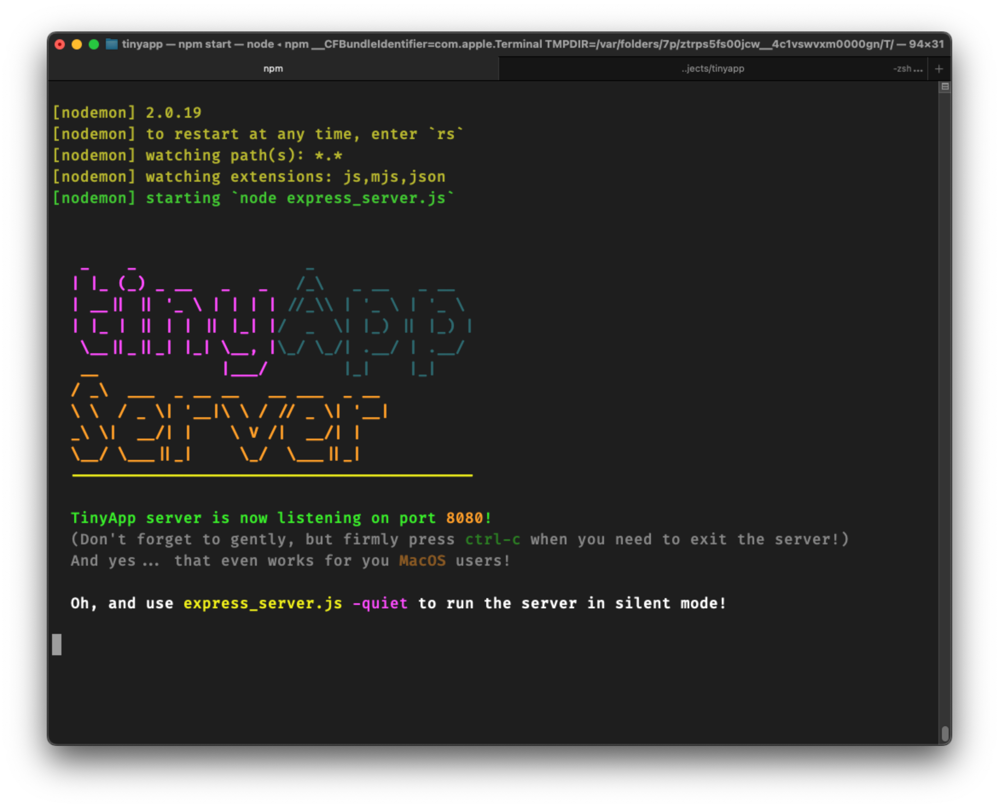

# TinyApp!
TinyApp! is a free URL shortening service and link management system. It is derived from the <a href="www.lighthouselabs.ca">Lighthouse Labs</a> (LHL) full stack web development bootcamp project.

Existing LHL students can review the project here:  
https://flex-web.compass.lighthouselabs.ca/projects/tiny-app  

---

  

---
## QUICK START:
1) start the TinyApp Server with  
  ```node express_server.js```   
  you can also use 'quiet mode' via  
  ```node express_server.js -quiet```  
2) start the web app in your browser with  
```localhost:8080/```  
---
## DETAILED OPERATION:
1) start the server as mentioned in quick start.  
```node express_server.js```

2) Once the server is "listening", start your web browser and navigate to ```http://localhost:8080/```
3) 
----
## FEATURES:
  
---
## EXTRA FEATURES:
- hide menu bar if not logged in
- "quiet" mode to silence server-side feedback
- 
---
## FUTURE PLANS:
- dark mode

---
## ATTRIBUTES:
- title icon created by <a href="https://www.flaticon.com/free-icons/rocket" title="rocket icons">Freepik - Flaticon</a>
- css styling, in part, by <a href="https://getbootstrap.com">Bootstrap</a>
---