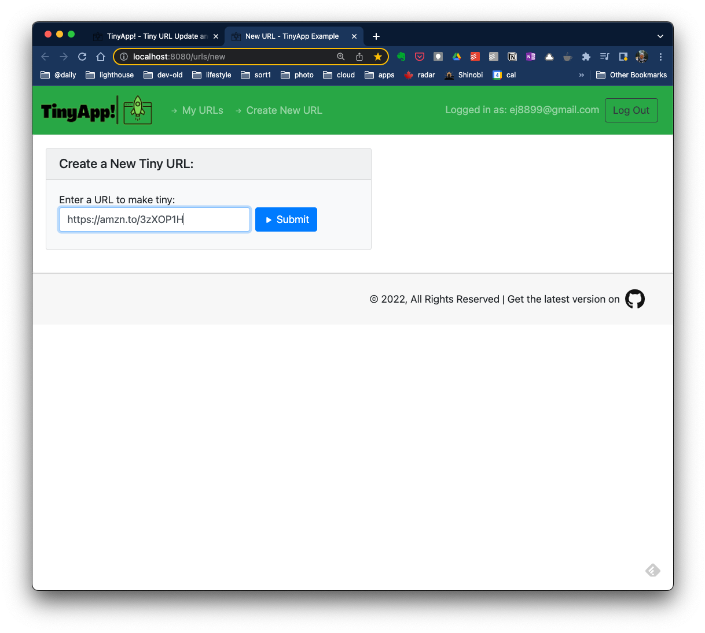
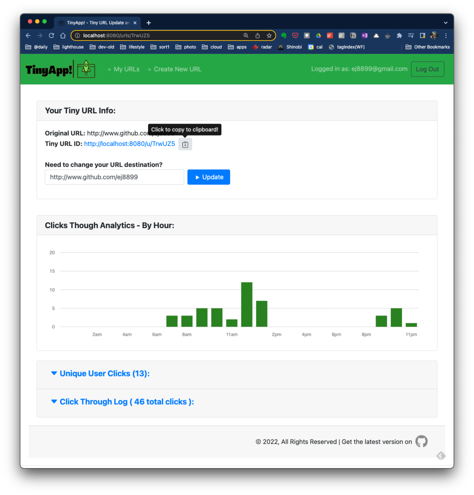

# TinyApp!
## About:
TinyApp! is a free URL shortening service and link management system. It is derived from the <a href="www.lighthouselabs.ca">Lighthouse Labs</a> (LHL) full stack web development bootcamp project.

Existing LHL students can review the project here:  
https://flex-web.compass.lighthouselabs.ca/projects/tiny-app  

---


  
---
## Contents:
1. [Features](#features)
2. [Extra Features](#extra-features)
3. [Future Plans](#future-plans)
4. [Quick Start](#quick-start)
5. [Detailed Operation](#detailed-operation)
6. [Known Bugs](#known-bugs)
7. [Attributions](#attributes)
8. [Updates](#updates)
---
## Features:
- free service
- secure
- easy to use
- allows for multiple tiny links to the same long URL
- analytics including hourly click thru chart  
[( back to top )](#about)
---
## Extra Features:
- hide menu bar if not logged in
- "quiet" mode to silence server-side feedback
    * use ```-quiet``` as starting argument
- optional log file generation:  
    * use ```-logfile``` as starting argument
- chain input arguments such as:
    * ```-quiet -logfile``` to quiet server visual feedback, but create log file instead
- incorrect password sends error to user
- trying to create duplicate accounts sends error to user
- _stretch_: shows total clicks on a tiny url (in edit page)
- _stretch_: shows unique clicks on a tiny url (in edit page)
- _stretch_: create click through log for each tiny URL  
[( back to top )](#about)
---
## Future Plans:
- dark mode
- additional link analytics (more graphs)
- customizable tiny url
- add password reset to login page
- multiple tiny url selection for bulk delete
- paginate click through logs  
- allow main URL page sorting - by date added, long url alphabetical, # of clicks, etc
- track hackers - if registered users try to manipulate other owner ID's, track & block them by email & IP.
[( back to top )](#about)
---
## Quick Start:
1) start the TinyApp Server in your terminal with  
  ```node express_server.js```   
  -you can also use 'quiet mode' via  
  ```node express_server.js -quiet```  
  -you can also use ```-logfile```  to create a server log file
2) start the web app in your browser with  
```localhost:8080/```  
[( back to top )](#about)
---
## Detailed Operation:
1) start the server as mentioned in quick start.  
```node express_server.js```

2) Once the server is "listening", start your web browser and navigate to ```http://localhost:8080/```  
You'll be directed to the login page.  An account is required to create and manage your Tiny URLs.

3) Sign in or register for a free account to get started. You'll be directed to your main account page listing any Tiny URLs you've created. From the main page, you can edit, delete or create tiny URLs.

4) Create new tiny URLS with the "Create" option.  Simply enter the long URL, and click or tap "submit". You'll return to the tiny URLs list (above) and see your new link added to the list!

5) Update and modify tiny URL destinations through a dedicated update page.  
You can also review link analytics on this page such as total click throughs, unique click throughs by users.  Additionally, the complete log of clicks, which includes the dates and times of when the tiny URL was clicked, is available too! 

[( back to top) ](#about)
----
## Known Bugs:  
- clipboard "icon copy" of tiny url has minor 'shift' when clicked 
----
## Attributions:
- title icon created by <a href="https://www.flaticon.com/free-icons/rocket" title="rocket icons">Freepik - Flaticon</a>
- css styling, in part, by <a href="https://getbootstrap.com">Bootstrap</a>
- misc JS libraries by <a href="http://www.github.com/ej8899">ej-dev conColors(github)</a>
---
## Updates:
- Get the most recent version of TinyApp! [here](https://github.com/ej8899/tinyapp).
- Change Log v 0.9 - 2022-08-06:  
    * (private testing only)
    - add encrypted cookies

---
[( back to top )](#about)
