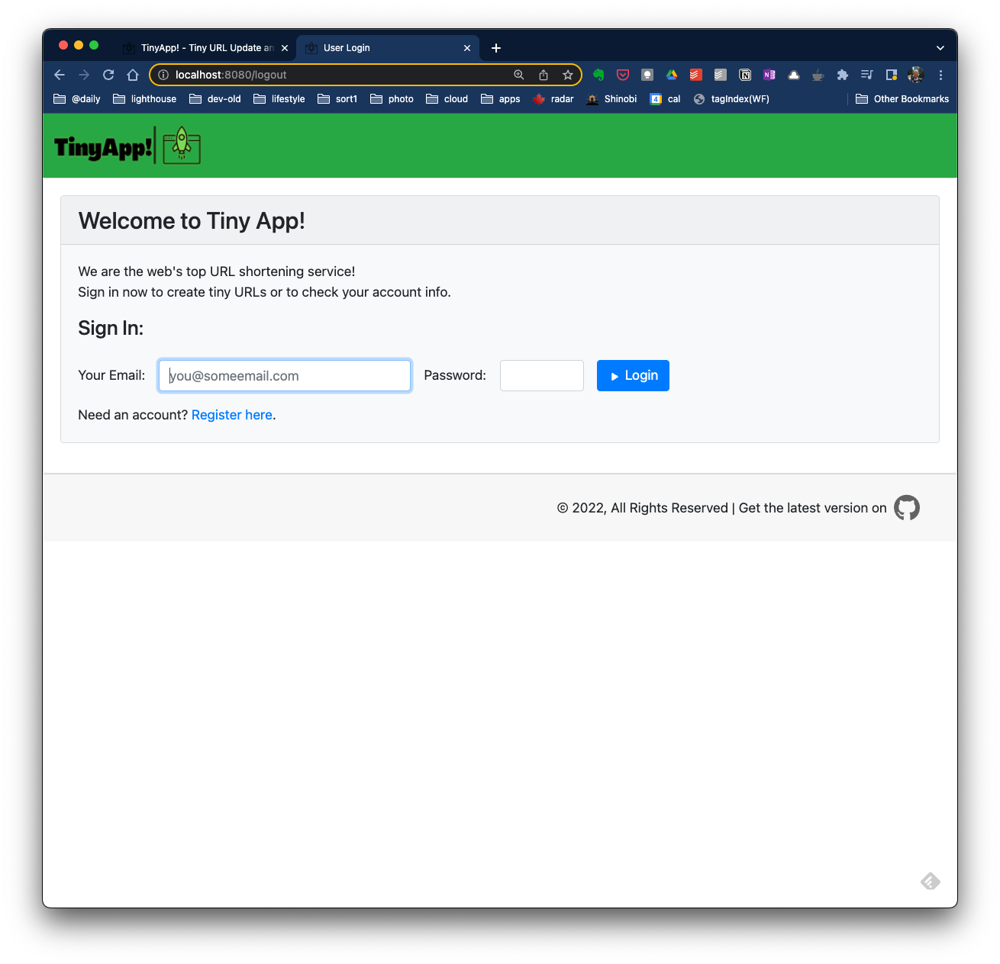
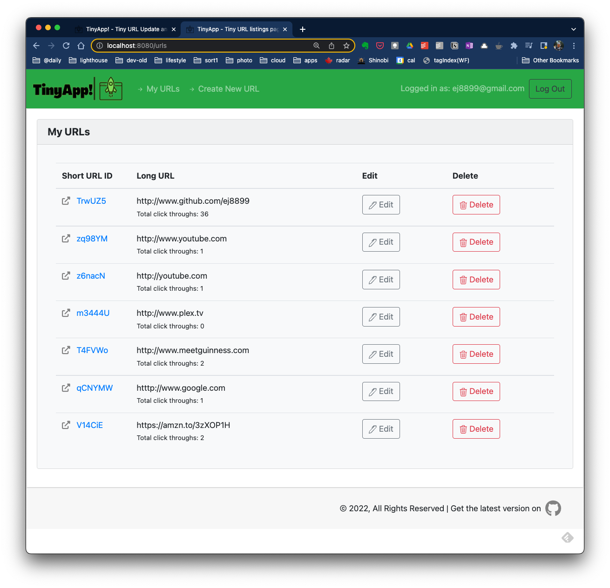

# TinyApp!
## About:
TinyApp! is a free URL shortening service and link management system. It is derived from the <a href="www.lighthouselabs.ca">Lighthouse Labs</a> (LHL) full stack web development bootcamp project.

Existing LHL students can review the project here:  
https://flex-web.compass.lighthouselabs.ca/projects/tiny-app  

---


  
---
## Contents:
1. [Quick Start](#quick-start)
2. [Detailed Operation](#detailed-operation)
3. [Features List](#features)
4. [Extra Features](#extra-features)
5. [Future Plans](#future-plans)
6. [Attributions](#attributes)
7. [Updates](#updates)
---
---
## Quick Start:
1) start the TinyApp Server with  
  ```node express_server.js```   
  you can also use 'quiet mode' via  
  ```node express_server.js -quiet```  
2) start the web app in your browser with  
```localhost:8080/```  
---
## Detailed Operation:
1) start the server as mentioned in quick start.  
```node express_server.js```

2) Once the server is "listening", start your web browser and navigate to ```http://localhost:8080/```  
You'll be directed to the login page.  An account is required to create and manage you Tiny URLs.

3) Sign in or register for a free account to get started you'll be directed to your main account page listing any Tiny URLs you've created. From the main page, you can edit and delete existing short URLs, or create a new tiny URL.

----
## Features:
- free service
- secure
- easy to use
- allows for multiple tiny links to the same long URL
---
## Extra Features:
- hide menu bar if not logged in
- "quiet" mode to silence server-side feedback
---
## Future Plans:
- dark mode
- link analytics
- customizable tiny url
---
## Attributes:
- title icon created by <a href="https://www.flaticon.com/free-icons/rocket" title="rocket icons">Freepik - Flaticon</a>
- css styling, in part, by <a href="https://getbootstrap.com">Bootstrap</a>
---
## Updates:
- Get the most recent version of TinyApp! [here](https://github.com/ej8899/tinyapp).
- Change Log v 0.9 - 2022-08-06:  
    * (private testing only)

---
[back to top](#about)